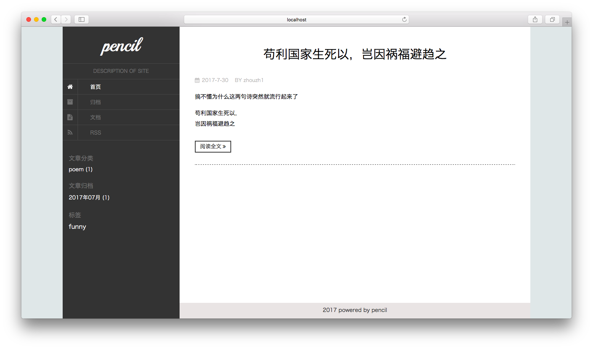

# Pencil

Pencil is a generator of static blog. In fact, it's a command line program written in Node.js. With the use of pencil, users need to edit markdown and execute corresponding command only, pencil will generate a blog site for you.



# Install

`npm install pencil-cli --global`

# Usage

Before using pencil, you must ensure that you have installed Node.js and Git client. Git client will be used to manage versions of your site files and deploy your blog to Github or your own server.

## - Scaffolding

Scaffolding contains directory tree of blog site, it is shown as following.

```
.
|____site
  |____config.yml      # configuration file
  |____public          # root directory of site
    |____site_assets   # static assets of site
    |____theme_assets  # static assets of theme in use
  |____source          # markdown source file
  |____plugins         # plugins for site
  |____themes          # themes for blog
```

## - Commands

- `pencil help [command]` Show help information
- `pencil init <dir>` Initiate a new blog, `<dir>` could be absolute or relative path, but must be empty. After initiation, you need to change your working directory to `<dir>`
- `pencil create <type> <title>` Create a new article or independent page, but just is a draft, `<type>` could be 'article' or 'page', `<title>` will be article's or page's title. After creation, program will generate a markdown file for corresponding type and open you default editor with that markdown file. In addition, program has written frontmatter to draft, you can attach a category and some tags to article, and specify the final html's filename
- `pencil publish <type> <title>` Publish draft, `<type>` and `<title>` is the same as in `create`
- `pencil generate` Generate a static blog site for you
- `pencil server [port]` Start a local server listening on `[port]` to preview your blog site, default `[port]` is 3000
- `pencil push` Push your blog site to remote server
- `pencil list [type]` List drafts, articles and independent pages
- `penicl edit <type> <title>` Open default editor to edit markdown
- `pencil delete <type> <title>` Delete drafts, articles and independent pages

## - Deploy

If you use private vps to host site, please install git server firstly, otherwise use [GithubPages](https://pages.github.com/).

For reason that github pages allows user and organization site to be built from master branch only, when you execute `pencil push`, the local master branch will be pushed to remote source branch and directory './public' will be pushed to remote master branch, in fact, `git push origin master:source` and `git substree push --prefix public origin master` are executed underwater. 

# Customization

## - Configuration

`/config.yml` is the only configuration file in your site, you can modify and add various options according to your fact need. All the information will be loaded to data which is used to render templates.

## - Theme

Pencil used ejs as the template engine of theme, a valid theme must have `views`, `views/index.ejs`, `views/article.ejs`, `views/page.ejs`, and `theme_assets`, they will be used to generate index pages, article pages and independent pages respectively, `views/archive.ejs`, `views/tag.ejs`, `views/category.ejs` will be used to generate archive page, summary page of tags and categories if they are exist. If you attach a category or some tags to articles, index pages of categories or tags will be generated automatically.

When you write your own theme, all template data has been stored in variable `locals`, its value is shown as following. In addition, you can add a `config.yml` in theme directory to adjust theme's final display.

**Attention: all static files referenced in theme templates, articles and independent pages must use absolute path** 

```js
locals = {
    // configuration information from config.yml
    config: {
        site: {
            host: 'http://blog.me',
            title: 'title of blog',
            description: 'description of blog'
        },
        contact: {
            email: 'your.gmail.com',
            weibo: 'your.weibo.com',
            github: 'your.github.com'
        },
        // configuration of theme
        themeConfig: { ... }
    },
    // data generated by pencil's main program
    data: {
        // label indicates position of current page
        label: 'index',
        // all tags attached to articles
        tags: {
            JavaScript: [article_1, article_2, article_3, ...],
            Python: [article_1, article_2, article_3, ...]
        },
        // all categories attached to articles
        categories: {
            frontend: [article_1, article_2, article_3, ...],
            database: [article_1, article_2, article_3, ...]
        },
        // archive information of all articles
        archives: {
            "2017": {
                "06": [article_1, article_2, article_3, ...],
                "07": [article_1, article_2, article_3, ...]
            },
            "2016": {
                "08": [article_1, article_2, article_3, ...],
                "09": [article_1, article_2, article_3, ....]
            }
        },
        // links of independent pages
        pageLinks: {
            about: '/page/about.html'
        },
        // articles data in various index pages
        articles: [article_1, article_2, article_3, ....],
        // article data in article page 
        article: {
            title: 'study javascript',
            tags: ['javascript', 'node'],
            category: 'frontend',
            createdTime: '2017-01-01 09:00',
            content: 'html string of content',
            abstract: 'html string of abstract',
            // filename of final article page generated
            filename: 'study_javascript.html'
        },
        // page data in independent page
        page: {
            title: 'about',
            createdTime: '2017-01-01 09:00',
            content: 'html string of content',
            filename: 'about.html'
        }
    },
    // result returned by plugin function
    plugins: {
        tagcloud: '<div class="tag-cloud">...</div>'
    }
}
```

## - Plugin

In fact, every plugin should be a function, once you place a plugin in `/plugins` directory, plugin function will be called with seven arguments automatically, the seven arguments are `config`, `articles`,  `pages`, `tags`, `categories`, `archives`, `pageLinks`. Return value of plugin function will be inserted to `locals.plugins`.

# License

MIT license